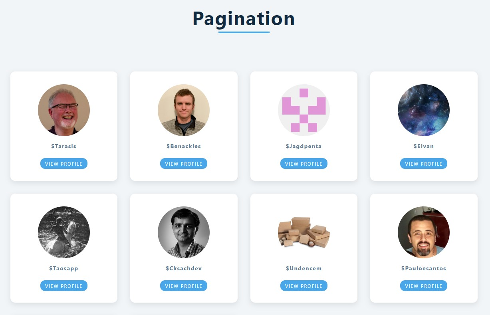

## Pagination !  👨‍🦱 👨‍🦰 👩

### [Pagination React-js](https://alisson-aguiars2k.github.io/pagination-react-js/) 🔗

## Tecnologias que utilizei para o projeto ;  

 
    
    
    
    

## Uma aplicação podemos navegar sobre as páginas, cada uma contendo um limite de 12 resultados, consumindo a API do ( GitHub ).
## O código foi desenvolvido usando ;
- Hooks useState e useEffect.
- API local
## A estilização foi feita com ;
- Styled Components. 💻 📚
 
